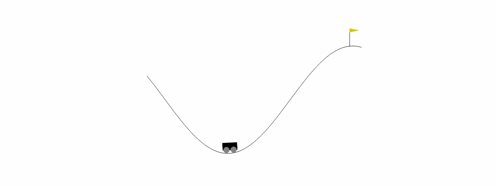

# Mountain-Car-RL
Mountain Car is a classic reinforcement learning problem, often used as a benchmark for testing the performance of reinforcement learning algorithms. In this problem, an underpowered car must climb a steep hill to reach a goal located at the top of the hill. The car is subject to the laws of physics, which means that it cannot simply drive straight up the hill. Instead, it must build up speed by accelerating back and forth across the hill.  

The state of the Mountain Car environment is represented by two continuous variables, the position and velocity of the car. The goal of the agent is to learn how to control the car's acceleration to climb the hill and reach the goal as quickly as possible while using the least amount of energy. The agent receives a negative reward for every time step it takes to reach the goal, so the goal is to minimize the number of time steps required to reach the goal.

The main goal of this project is to implement two agents to solve the Mountain Car problem: the Q-learning and the deep learning agent.
